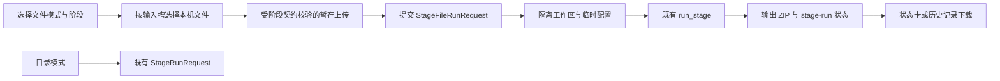

# 单阶段文件模式设计

## 0. 术语约定

- **目录模式**：沿用既有 `POST /api/stages/{stage_name}`，针对当前设置绑定的目录批量运行。
- **文件模式**：操作者为当前阶段选择其所需的本机文件；服务端复制到该次 `stage-run` 的隔离工作区后仅运行这一个阶段。
- **阶段输入槽**：一个由阶段定义的具名文件位置，例如 `transcribe` 的音频、`align` 的 ASR JSON 与参考 TXT；不接受用户提供服务器路径。
- **结果归档**：文件模式完成后，从该次隔离工作区的本阶段输出生成 ZIP 文件，下载名由操作者填写的结果名称决定。

## 1. 决策与约束

### 需求摘要

操作者需要在单阶段页直接选择本机文件并下载本次结果，而非只能针对预先固定的全局目录运行。目录批处理仍要保留，以兼容既有恢复与维护工作流。

成功标准：

1. 页面可在“本机文件”和“当前配置目录”之间切换，文件模式为默认测试路径。
2. 每个阶段只展示其实际需要的输入槽；双输入阶段要求两个文件，但不要求原文件名相同。
3. 文件模式的输入与输出只存在于该次 stage-run 工作区，不写入全局 `data/input` 或中间产物目录。
4. 成功运行可从历史记录或状态卡下载用户命名的 ZIP 结果。
5. 原有目录模式、覆盖参数与历史状态恢复保持可用。

明确不做：

- 不允许浏览器指定服务端输出路径或通过路径字符串读取任意文件。
- 不改变正常流水线的全局目录、已有单任务和批量任务协议。
- 不在前端自动重试上传或阶段运行。
- 不把本机文件永久写入设置页或全局配置。

复杂度档位：跨前端、API 与既有阶段执行器的局部功能扩展；沿用已有 stage-run 状态和任务执行机制。

关键决策：浏览器无法安全决定本机保存目录，服务端也不应接收任意输出目录。因此“选择输出”实现为填写归档名称并下载；浏览器由用户自己的下载设置决定最终保存位置。

## 2. 名词与编排

### 2.1 名词层

**现状**：`StageRunRequest` 只包含 Profile 与模型覆盖字段；`execute_stage_run` 将这些覆盖应用到当前项目配置，然后由各阶段批处理函数扫描固定目录。状态只记录单一 `output_path`。

**变化**：新增 `StageFileRunRequest`，包含既有覆盖字段、具名 `input_files` 和 `result_name`。新增阶段输入槽契约，以同一份定义驱动上传校验、工作区放置与页面文件选择。

文件模式输入契约：

| 阶段 | 输入槽 |
| --- | --- |
| `extract-audio` | 视频文件 |
| `transcribe` | 音频文件 |
| `prepare-reference` | TXT、Markdown 或 PDF 参考文件 |
| `align` | ASR JSON、参考 TXT |
| `classify` | 对齐 JSON |
| `refine` | ASR TXT、参考 TXT |
| `export-markdown` | 精修 JSON |

配对阶段会在工作区使用统一的安全基础名放置两个文件，使既有按文件名匹配的阶段逻辑仍然成立；原文件名只用于页面显示和输入摘要。

接口示例：

```text
POST /api/stage-inputs/transcribe/audio?filename=lesson.wav
→ { path: ".../data/uploads/stage-inputs/.../lesson.wav" }

POST /api/stages/transcribe/file-run
{
  "input_files": { "audio": ".../data/uploads/stage-inputs/.../lesson.wav" },
  "result_name": "lesson-asr",
  "profile": "local_cpu"
}
→ { "run_id": "..." }

GET /api/stage-runs/{run_id}/result
→ attachment: lesson-asr.zip
```

### 2.2 编排层

**现状**：单阶段页固定提交 JSON 到既有 stage-run 接口；后端同步创建状态后异步调用 `execute_stage_run`，每个阶段从设置路径读取批量输入。

**变化**：文件模式先按当前阶段输入槽逐个上传原始文件，再提交文件模式运行请求。服务端只接受位于专用暂存根目录的上传结果，把它们复制到 `data/jobs/stage-runs/{run_id}/workspace/` 的对应输入位置，生成仅指向该工作区的临时配置，并调用同一 `run_stage`。成功后将当前阶段输出打为 ZIP，状态记录归档路径和下载名。



跨层纪律：

- 上传端点基于阶段和输入槽校验扩展名；创建文件运行时再次验证暂存路径属于专用上传根，不能信任客户端传来的任意路径。
- 结果下载仅按 run ID 读取其状态所记录的归档，不接受用户提供的文件路径。
- 运行失败保留该次工作区与真实错误，以便排查；用户删除历史记录时沿用既有删除语义清理该 run 目录。
- 本机文件模式与目录模式使用同一 stage-run 历史、状态轮询和模型覆盖语义。

### 2.3 挂载点清单

- 单阶段 API：新增受限上传、文件运行提交和结果下载入口。
- stage-run 执行编排：新增隔离工作区、临时配置和归档构建分支。
- 单阶段页面：新增模式选择、阶段输入槽选择、归档名称和下载动作。
- API 客户端：声明文件模式请求、上传和下载协议。

### 2.4 推进策略

1. 文件契约与隔离工作区：定义各阶段输入槽、校验和输出归档。退出信号：给定阶段和文件槽可安全放入正确工作区，且不会写入全局目录。
2. API 编排：加入上传、文件运行提交、状态持久化与下载入口。退出信号：内联任务可成功得到 run 状态与归档，非法槽/路径被拒绝。
3. 页面交互：加入文件/目录模式、具名上传、归档名称与下载入口。退出信号：页面只展示当前阶段相关的文件控件，并能提交现有覆盖参数。
4. 验证收尾：补齐 API 与契约测试、构建及真实页面检查。退出信号：全量测试与前端构建通过，文件模式不触碰全局流水线目录。

## 3. 验收契约

1. 选择 `transcribe` 的文件模式，上传 WAV 并提交归档名称 → 运行配置只指向该 run 工作区，成功后可下载指定名称的 ZIP。
2. 选择 `align` 或 `refine` → 页面要求两个输入槽；后端用统一工作区基础名放置文件，使既有匹配逻辑可处理不同原始文件名。
3. 将不属于该阶段输入槽的扩展名上传，或向文件运行提交专用暂存根以外的路径 → 明确返回错误且不创建可执行任务。
4. 选择目录模式 → 仍调用既有 JSON stage-run 接口，不出现上传要求。
5. 成功的文件运行从历史记录恢复后 → 状态卡继续显示下载入口；失败状态不提供结果下载。
6. 反向核对：文件模式不提供任意服务端目录写入、路径遍历或全局配置持久化。

## 4. 与项目级架构文档的关系

当前仓库没有 `codestable/architecture/` 或 `codestable/requirements/` 基线文档。本功能局限于已有 Web API 和 stage-run 工作流；验收时根据实际公共接口变化决定是否补充架构回填。
