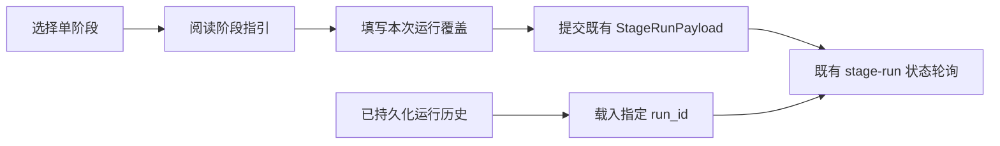

# 单阶段测试工作台设计

## 0. 术语约定

- **单阶段运行**：对当前项目配置绑定的数据目录运行一个既有流水线阶段，对应 `POST /api/stages/{stage_name}`；不等同于临时单文件上传。防冲突结论：沿用现有 `stage-run` 状态类型。
- **本次运行覆盖**：只随单次 StageRunRequest 提交的 Profile、推理后端、OCR 后端、模型和推理强度；空值表示使用已保存设置，不写回设置页。防冲突结论：沿用现有 `StageRunPayload` 字段。
- **阶段指引**：针对当前选中阶段展示其配置目录输入、预期输出和适用测试场景的只读说明。防冲突结论：不新增后端状态或路径协议。

## 1. 决策与约束

### 需求摘要

为需要手动测试阶段 3 PDF OCR、阶段 6 精修及其他已存在流水线步骤的操作者，提供一个能明确“这次以什么参数运行、需要准备什么、结果在哪里看”的单阶段工作台。

成功标准：

1. 操作者可在页面上为当前单阶段运行显式覆盖既有接口已支持的参数，并在提交时完整发送。
2. 选中 `prepare-reference` 时，可直接覆盖 PDF OCR 后端、模型和推理强度；选中 `refine` 时，可直接覆盖推理后端、模型和推理强度。
3. 页面刷新后，操作者可从已持久化的 stage-run 历史中重新载入状态并继续查看运行结果。
4. 页面能清楚说明每个阶段作用于当前配置目录，而非临时上传文件。

明确不做：

- 不新增单文件上传、目录选择或改变当前阶段的数据目录。
- 不新增或修改后端 API、状态结构及鉴权逻辑。
- 不通过路径穿越或其他绕过方式预览全局 `data/` 目录产物。
- 不把本次覆盖参数保存到全局设置，也不在页面自动重试失败任务。

复杂度档位：走项目内局部前端交互增强默认档位，无偏离。

关键决策：复用既有 `StageRunPayload` 和 stage-run 状态 API，而不是新建“测试任务”协议；这使一次测试与正式单阶段运行拥有相同的后端语义和状态追踪方式。

## 2. 名词与编排

### 2.1 名词层

**现状**：`StageRunPayload` 已包含 `profile`、`backend`、`model`、`reasoning_effort`、`ocr_backend`、`ocr_model` 和 `ocr_reasoning_effort`，但 `StageRunnerView` 提交固定空对象，因此无法从页面使用这些覆盖项。stage-run 状态可通过 `listStageRuns()`、`getStageRun()` 读取。

**变化**：单阶段页新增“本次运行覆盖”表单状态和“阶段指引”只读定义；运行历史仅保存并恢复既有状态 ID，不虚构未持久化的历史参数。

接口示例：

```ts
// 来源：frontend/src/views/StageRunnerView.vue submit
submitStageRun("prepare-reference", {
  profile: "wsl2_gpu_high_accuracy",
  ocr_backend: "codex_api",
  ocr_model: "gpt-5.4-mini",
  ocr_reasoning_effort: "high",
});
```

清空任一覆盖控件时，对应字段以 `null` 提交，后端继续按既有优先级使用已保存设置。

### 2.2 编排层



**现状**：页面只有阶段下拉与“立即运行”按钮，提交 `{}` 后轮询刚生成的 run_id；刷新页面后没有恢复入口。

**变化**：阶段选择首先切换对应的输入/输出指引和相关覆盖控件。提交时仅组装当前可见的覆盖字段。页面初次加载读取全部既有 stage-run 状态，点击历史项会加载其状态；运行中的项继续轮询，终态项只展示已有结果。

跨层纪律：

- 空覆盖字段必须保持为空，不可把当前页面值写进 FrontendSettings。
- `prepare-reference` 的 OCR 覆盖不得伪装为阶段 6 推理覆盖；`refine` 的推理覆盖不得伪装为 OCR 覆盖。
- 提交或读取历史失败时保留当前表单与已加载状态，并显示真实错误信息。
- 历史仅使用既有 `/api/stage-runs` 和 `/api/stage-runs/{run_id}`，不新增删除、上传或目录浏览副作用。

### 2.3 挂载点清单

- `frontend/src/views/StageRunnerView.vue`：修改既有 `/stage-runner` 路由页面，加入覆盖表单、阶段指引与历史状态恢复入口。

本 feature 不引入新的路由、后端端点、配置项或持久化数据结构。

### 2.4 推进策略

1. 静态结构：建立阶段指引和按阶段显示的覆盖表单。退出信号：选中不同阶段时，页面显示正确的测试说明和控件。
2. 提交编排：将页面覆盖状态映射到既有 StageRunPayload。退出信号：触发运行时请求体包含非空覆盖，空控件仍保留默认语义。
3. 历史状态接入：加载既有 stage-run 列表并允许选中查看。退出信号：刷新后可再次查看历史运行状态。
4. 联调与样式收尾：验证窄屏/宽屏可读、运行与错误反馈可见。退出信号：构建通过且手工测试路径完整。

## 3. 验收契约

1. 选择 `prepare-reference`，填写 OCR 后端、模型和推理强度后提交 → 请求体仅包含这些 OCR 覆盖和已选 Profile，状态卡展示新 run。
2. 选择 `refine`，填写推理后端、模型和推理强度后提交 → 请求体包含这些推理覆盖，OCR 覆盖控件不参与提交。
3. 清空所有覆盖后提交 → 请求体中的覆盖值为 `null`，后端继续使用设置页默认值。
4. 页面刷新后选择历史 stage-run → 重新显示对应状态；运行中状态继续刷新，成功或失败状态停止刷新。
5. 选择任一阶段 → 页面显示其当前配置目录输入和预期输出，且明确不是临时文件运行器。
6. 反向核对：代码中不新增 `/api` 路由、文件上传调用、目录遍历或通过 `..` 访问非本任务产物的逻辑。

## 4. 与项目级架构文档的关系

本 feature 改动局限于既有单阶段运行前端入口；不新增系统级数据结构、协议或跨模块工作流。验收阶段确认后无需回写项目级架构文档。
