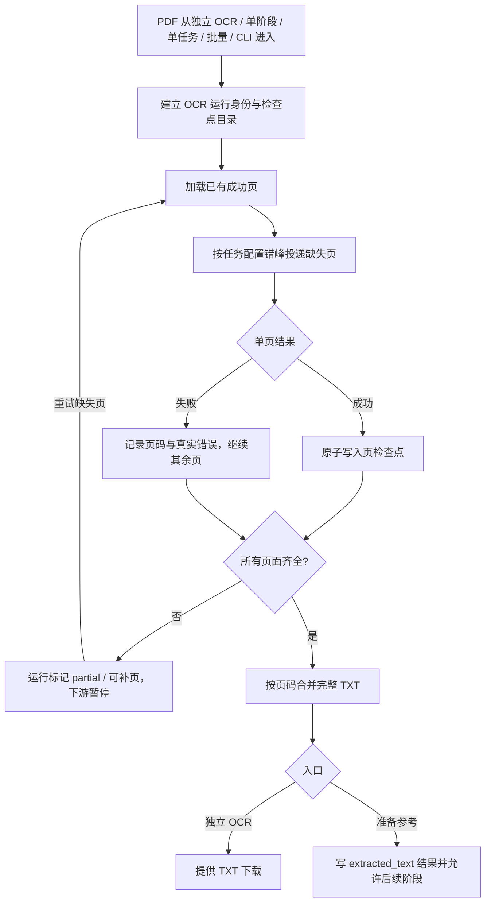

# 准备参考 PDF OCR 同步设计

## 0. 术语约定

- **统一 PDF OCR 工作流**：独立 PDF OCR 与准备参考阶段共同使用的 Codex API 单页识别、错峰调度、页检查点、缺页汇总和整本合并流程。
- **准备参考运行**：通过单阶段、单任务、批量任务或命令行进入 `prepare-reference` 的一次执行。
- **页检查点身份**：由 PDF 内容、OCR 模型、推理强度和 OCR 协议版本共同确定的检查点命名空间；身份不一致时不得复用旧页。
- **补页重试**：沿用同一运行和页检查点，只处理尚未形成成功页文件的页面。
- **非 PDF 参考资料**：TXT 和 Markdown，继续由准备参考阶段直接读取，不进入 OCR 工作流。

防冲突结论：项目已有“页检查点”“缺页重试”和“stage-run”术语，本设计直接复用，不再引入第二套
“断点”“续跑任务”等近义概念。

## 1. 决策与约束

### 需求摘要

准备参考阶段处理 PDF 时，当前虽然调用了与独立 PDF OCR 相同的底层识别函数，但没有传入检查点，
页面不能自定义投递间隔和并发，失败后还可能静默切换到文字层或其他 OCR 路线。操作者希望所有入口
都采用独立 PDF OCR 的模式，避免同一本 PDF 因入口不同而表现不同。

成功标准：

1. 独立 PDF OCR、准备参考单阶段、单任务、批量任务和 CLI 使用同一统一 PDF OCR 工作流。
2. 所有入口默认采用 5 秒投递间隔和 40 个最大在途请求，并可按本次运行覆盖。
3. 单页失败后继续本轮其余页面，成功页立即原子落盘；整本 TXT 只在所有页面齐全后生成。
4. Web 运行显示页总数、成功页数、失败页码和逐页错误，并提供同一运行的“重试缺失页”入口。
5. 应用或 codex-lb 重启后，重新执行同一运行只识别缺失页，不重复调用已成功页面。
6. 单任务和批量任务在准备参考未补齐时不得继续进入 refine/export；补齐后可从准备参考继续下游。
7. TXT 和 Markdown 参考资料行为保持不变。

明确不做：

- 不生成缺页的参考 TXT，也不让下游消费不完整参考文本。
- 不加入固定自动重试次数、静默跳页、文本截断或页数上限。
- 不把图片、插图说明或版面结构写入最终参考文本。
- 不在本功能中清理历史检查点；身份不同的旧检查点保留但不会被复用。
- 不改变独立 PDF OCR 已有的下载目录结构和历史任务语义。

### 复杂度档位

- 健壮性 = L3（偏离内部工具默认 L2：长任务涉及远程 API 成本，必须保证检查点身份、幂等恢复和错误显式可见）。
- 结构 = modules（偏离默认 functions：统一工作流同时服务独立工具、阶段运行和完整任务，不能继续由入口各自拼装）。
- 可测试性 = verified（偏离默认 testable：页完整性、检查点身份和下游阻断属于关键不变量）。
- 并发 = thread-safe；兼容性 = backward-compatible；幂等性 = idempotent。

### 关键决策

1. **统一工作流属于 OCR 核心，不属于独立页面。**  
   独立 PDF OCR 和准备参考都依赖同一份页运行结果；入口只负责输入、状态展示和最终产物转换。

2. **检查点必须绑定内容与 OCR 配置。**  
   仅按文件名复用会在同名 PDF 被替换、模型被调整或提示协议变化时混入旧文本，因此准备参考检查点
   使用内容及 OCR 配置指纹建立命名空间。相同输入和配置可恢复，不同身份自然进入新目录。

3. **Web 补页沿用同一运行 ID。**  
   stage-run、单任务和批量子任务都保留原有请求参数与工作区；重试不会创建一份无法关联旧检查点的
   平行任务。

4. **建议取消准备参考 PDF 的静默 fallback。**  
   草案按“完全同步”解释：PDF 选择 Codex API OCR 后，失败或缺页就进入可恢复状态，不自动改用
   PDF 文字层、agy、Codex CLI 或 ocrmypdf 冒充同一次成功。TXT/Markdown 直接读取不受影响。
   若仍需其他 OCR 后端，应由操作者显式选择并接受其不具备统一检查点协议，而不是运行中静默切换。

5. **旧运行向后兼容但不能伪造检查点。**  
   旧 stage-run/job 没有请求参数或页文件时，仍可查看原状态；首次重试只能把全部页面视为缺失。

### 前置依赖

当前工作区已经具备独立 OCR 的页检查点、失败继续和任务级 5 秒/40 并发覆盖，本功能以这些已实现
能力为基线，不重新设计调度器。

## 2. 名词与编排

### 2.1 名词层

**现状**

- `run_codex_api_pdf_ocr` 已接受 `checkpoint_dir` 和进度回调，但 `read_pdf_reference` 调用时未提供。
- `PDFBookOCRRequest` 已有任务级间隔与并发字段，`StageRunRequest`、`SingleJobRequest`、
  `BatchJobRequest` 和 `JobRerunRequest` 尚未声明这两个字段。
- `ReferenceFileResult` 只描述最终文本成功或失败，没有页级状态。
- 独立 PDF OCR 状态使用 `partial`、页总数、成功页数、失败页码和逐页错误；普通 stage-run/job
  状态没有统一的 OCR 进度契约。

**变化**

1. 新增公共的 **PDF OCR 运行身份**：

   ```text
   source_digest + model + reasoning_effort + protocol_version
   → checkpoint_namespace
   ```

2. 准备参考 PDF 结果扩展为可表达：

   ```json
   {
     "page_count": 603,
     "completed_pages": 602,
     "failed_page_numbers": [195],
     "page_errors": {"195": "upstream_unavailable"},
     "resumable": true
   }
   ```

3. 所有可能触发准备参考 PDF OCR 的请求统一接受：

   ```json
   {
     "ocr_model": "gpt-5.4-mini",
     "ocr_reasoning_effort": "high",
     "ocr_submit_interval_seconds": 5,
     "ocr_max_concurrency": 40
   }
   ```

4. stage-run/job 状态允许 `partial`，并复用独立 PDF OCR 的页进度字段；非 OCR 阶段不产生这些字段。

5. CLI 的准备参考入口和流水线入口增加同名调度参数；未传值时读取全局配置。

主要错误契约：

```text
非法并发或间隔
→ 请求/CLI 参数校验失败，不创建运行

一轮结束仍有缺页
→ status=partial，保留页检查点和逐页错误，不生成参考 TXT，不进入下游

同一运行再次补页且全部齐全
→ status=success，生成完整参考 TXT，可继续后续阶段
```

### 2.2 编排层



**现状**

- 独立 PDF OCR 已是“检查点 → 缺页调度 → partial → 同任务重试”的状态机。
- 准备参考是线性流程：读取 PDF → OCR 或 fallback → 写参考结果；stage-run/job 只识别
  running/success/failed，完整任务遇到非零退出码立即停止。
- 单任务和批量任务已有“从指定阶段重跑”能力，但 OCR 调度参数没有进入这些请求，也没有专用缺页状态。

**变化**

1. 准备参考 PDF 分支改为调用统一 OCR 工作流，并提供由当前工作区和运行身份确定的检查点根目录。
2. 准备参考批处理把页进度逐级上报给 stage-run、job 或 batch item 状态；目录中多本 PDF 时按书汇总。
3. 一轮存在缺页时，当前运行进入 `partial` 而非普通 `failed`；Web 显示缺页按钮。
4. stage-run 的补页接口重放原请求；文件模式继续使用原隔离工作区，目录模式继续使用原配置目录。
5. 单任务使用现有 job ID 和工作区；“重试缺失页”本质上从 `prepare-reference` 重跑同一 job，
   补齐后按原阶段顺序继续 refine/export。
6. 批量任务以子 job 为恢复单位；一本参考 PDF 的失败不触发其他子 job 的重复 OCR。
7. CLI 再次执行相同输入和配置时复用统一检查点；CLI 输出明确列出失败页并返回非零退出码。

跨层纪律：

- **完整性**：页文件存在才代表该页成功；空文件是合法空白页，不能按文本长度判断页面失败。
- **身份隔离**：源内容或 OCR 配置指纹变化时不得加载旧页；不静默删除旧目录。
- **幂等性**：重复补页只请求缺失页；全部齐全后再次运行不产生远程 OCR 请求。
- **顺序**：请求可并发和乱序完成，最终文本始终按 PDF 原页码拼接。
- **错误语义**：远程错误原文进入逐页错误；不将真实传输失败伪装成“无文本”或 fallback 成功。
- **下游门禁**：准备参考不是完整成功时，refine/export 不得启动。
- **可观测性**：状态和日志都暴露页总数、完成数、失败页码、任务调度参数及补页次数。

### 2.3 挂载点清单

- OCR 配置契约：`reference.codex_ocr_submit_interval_seconds` 与
  `reference.codex_ocr_max_concurrency` — 保持统一默认值并开放所有准备参考入口覆盖。
- Web 请求契约：stage-run、single job、batch job、job rerun — 增加统一 OCR 调度字段。
- Web 状态与操作：stage-run/job/batch item 状态卡 — 注入 `partial` 页进度和“重试缺失页”动作。
- CLI 契约：准备参考与流水线命令 — 增加投递间隔和最大并发参数。
- 页检查点命名空间：准备参考 OCR 输出根目录 — 新增运行身份隔离的持久化目录。

### 2.4 推进策略

1. 名词与身份契约：建立公共 OCR 运行身份、准备参考页结果和状态字段。  
   退出信号：相同输入/配置得到相同命名空间，任一身份变化得到不同命名空间。
2. 准备参考编排：接入检查点、页进度和 partial 结果，阻断不完整参考文本。  
   退出信号：模拟中间页失败后其余页继续，第二轮只请求缺页并生成完整参考 TXT。
3. 任务恢复：让 stage-run、单任务和批量子任务沿用原工作区补页并继续下游。  
   退出信号：服务重启或人工重试后不重复成功页，完整任务只在补齐后进入 refine。
4. 请求与 CLI 覆盖：统一模型、推理强度、间隔和并发参数。  
   退出信号：所有入口都能观察到本次运行的实际 5/40 或自定义值。
5. Web 交互：在准备参考相关页面显示调度输入、页进度、错误和补页按钮。  
   退出信号：桌面与窄屏均可设置并恢复历史任务，不提交无效边界值。
6. 兼容与验收：覆盖旧状态、旧请求、非 PDF 参考资料和真实 PDF 恢复。  
   退出信号：全量测试、前端构建和至少一个真实缺页补跑通过。

## 3. 验收契约

### 关键场景清单

1. 准备参考处理三页 PDF，第 2 页失败 → 第 3 页仍执行；运行状态为 `partial`，第 1、3 页检查点存在，
   不生成 extracted TXT，也不进入下游阶段。
2. 对上述同一运行点击“重试缺失页” → 只请求第 2 页；补齐后生成按 1、2、3 页排列的参考 TXT，
   状态变为 success。
3. 服务在部分页面成功后重启 → 状态恢复为可补页；再次运行不请求已有页。
4. 单阶段文件模式上传 PDF 并自定义 2.5 秒/12 并发 → 实际调度读取 2.5/12，历史状态保存原参数，
   补页仍沿用 2.5/12。
5. 单任务或批量子任务在准备参考缺页 → 当前 job 不进入 refine；补页成功后从 prepare-reference
   继续原定下游阶段。
6. 同名 PDF 内容被替换，或 OCR 模型/推理强度变化 → 不复用旧检查点。
7. 同一 PDF、同一配置已全部完成 → 再次运行直接从检查点生成/确认完整结果，不创建远程页请求。
8. TXT 或 Markdown 进入准备参考 → 仍直接生成参考文本，不创建 OCR 检查点。
9. 并发为 0 或间隔为负值 → Web/API/CLI 明确拒绝；不创建可执行运行。
10. 旧 stage-run/job 没有新字段 → 历史仍可查看；首次补页按无检查点任务处理，不伪造完成页。
11. 纯空白页明确返回空 `output_text` → 写入空页检查点并计为成功。
12. 多本 PDF 中一本缺页 → 状态逐本列出页进度；已成功书籍和页面不被重复 OCR。

### 明确不做的反向核对项

- 代码中不应出现缺页参考 TXT 被标记为成功或传给 refine 的路径。
- 统一 Codex API 路线中不应在页失败后自动调用 agy、Codex CLI、ocrmypdf 或文字层冒充成功。
- 不应新增固定自动重试次数、页数上限、文本截断或失败页静默跳过。
- 非 PDF 文件不应创建页检查点或出现 OCR 页进度字段。
- 独立 PDF OCR 的既有结果下载路径和任务历史格式不应被破坏。

## 4. 与项目级架构文档的关系

当前仓库没有 `codestable/architecture/` 或 `codestable/requirements/` 基线文档。验收阶段应回填：

- 系统级名词：统一 PDF OCR 工作流、OCR 运行身份、页检查点和 partial 可恢复状态。
- 跨模块动词骨架：独立 OCR / 准备参考入口 → 缺页调度 → 检查点 → 完整文本 → 下游门禁。
- 稳定约束：检查点身份隔离、空白页成功语义、缺页不生成完整文本、重试只处理缺失页。
