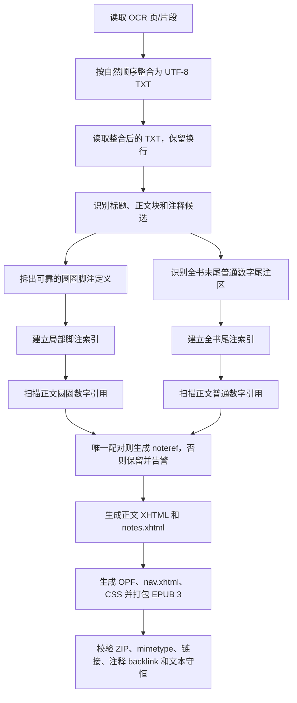

# OCR 文本 EPUB 导出设计

## 0. 术语约定

- **源文本**：PDF OCR 产生的 TXT。导出器只读取源文本，不回写或覆盖它。
- **正文块**：属于书籍正文、序言、章节标题或书末出版说明的文本块。
- **圆圈数字脚注**：使用 `①`、`②`、`③` 等标记的局部注释。标记可能在正文中，定义通常在正文段落后或页面边界附近。
- **普通数字尾注**：使用 `87`、`88`、`89` 等阿拉伯数字标记的注释。一次 OCR 覆盖整本书时，引用在正文中，定义可以统一位于全书最后的尾注区。
- **注释定义**：包含标记和注释正文的文本块，例如 `① 资产阶级是……` 或 `87 ……`。
- **注释引用**：正文中指向注释定义的标记。引用的可见字符必须保留，链接只是附加语义。
- **局部范围**：用于解析圆圈数字脚注的章节或正文单元。圆圈数字在不同章节可以重新从 `①` 开始。
- **全书尾注索引**：以普通数字标签为 key 的整本书级定义索引；只有定义唯一且可确认时才建立链接。
- **未配对引用**：没有可靠注释定义，或存在多个候选定义的引用。未配对引用保留原文，不生成失效链接。

本设计中的“脚注”和“尾注”指内容语义，不承诺在 reflowable EPUB 中复刻 PDF 的固定页底位置。

## 1. 决策与约束

### 需求摘要

现有项目已经能把 OCR 结果保留为 TXT/Markdown，但没有面向阅读器的 EPUB 导出。用户需要把 OCR 页/片段先按顺序整合成一个 TXT，再以这个整合后的 TXT 为唯一输入导出 EPUB，重点是让静读天下等阅读器可以正常阅读，并能在正文与注释之间跳转。

真实 OCR 样例表明，注释不能通过全局替换数字实现：

1. 圆圈数字定义经常从新行开始，但定义结束后又粘着下一段正文或下一章标题。
2. 圆圈数字会在不同正文单元中重复，`①` 本身不是全书唯一 ID。
3. 普通数字引用可能紧贴正文末尾，例如 `社会主义者报91`，而对应定义在整本书最后的尾注区。
4. 普通数字还会出现在年份、日期、版次、页码或正文数字中，不能把所有阿拉伯数字都当作尾注引用。
5. 当前真实样例是从全集中提取的正文，未包含相应尾注；因此“找不到定义”必须是可观测的未配对状态，而不是自动猜测。只有整合后的 TXT 确实包含尾注区时，普通数字才有配对来源。

成功标准：

1. 给定一份完整 OCR TXT，可以生成 EPUB 3 reflowable 文件，静读天下等阅读器能打开、导航和阅读。
2. 正文段落、章节标题和源文本中的非注释内容基本保持；源 TXT 不被修改。
3. 能识别圆圈数字脚注，并将引用链接到对应脚注，再从脚注返回正文。
4. 能识别全书末尾的普通数字尾注，并把正文引用链接到唯一的尾注定义，再从尾注返回正文。
5. 圆圈数字重复时按出现位置和局部范围生成唯一注释 ID，不发生跨章节串注。
6. 同一行中“注释结束 + 下一段正文/标题”的 OCR 粘连不会把后续正文吞进注释。
7. 无定义、定义重复或无法确认的数字保留原文，并输出可追踪 warning；不得产生坏链接。
8. EPUB 包含标准目录、注释语义、返回链接和中文语言元数据；不要求所有阅读器都以弹窗形式呈现注释。

明确不做：

- 不修改现有 OCR TXT、Markdown 导出结果或已有中间 JSON。
- 不把 EPUB 混入现有 OCR 主流程、Web 页面或既有 Markdown 导出阶段；第一版提供独立 CLI。
- 不使用 LLM 猜测脚注/尾注对应关系，不为了“提高链接率”把年份或普通数字强行链接。
- 不自动补齐当前源文本中不存在的尾注定义。
- 不生成固定版式 EPUB，不承诺保留 PDF 的页底位置、扫描图片版面或页码坐标。
- 不生成封面图片；可保留书名、作者、语言等文本元数据。
- 不为规避异常加入无依据的文本长度、页数、条数、重试次数或静默截断限制。

### 复杂度档位

- 健壮性 = L3：注释误配会改变阅读含义，必须优先保证不误链、不丢正文。
- 结构 = modules：解析、注释配对、EPUB 封装和验证需要隔离，不能继续堆进 Markdown 导出函数。
- 可测试性 = verified：应覆盖全文尾注、重复圆圈数字、OCR 粘连、年份排除和无定义保留。
- 兼容性 = backward-compatible：现有 TXT、Markdown、JSON 和主流程行为保持不变。
- 幂等性 = idempotent：同一输入和参数重复导出得到等价 EPUB，不产生额外副作用。

### 关键决策

1. **先整合 TXT，再独立导出 EPUB。** 新增文本整合入口：输入单个 OCR TXT 时做换行规范化，输入 OCR 片段目录时按稳定的自然顺序合并，并输出独立 UTF-8 TXT。EPUB 入口只读取这个整合后的 TXT，默认输出同名 `.epub`；不改变现有 `export-markdown` 的行为，也不要求 OCR 阶段重新运行。

2. **先收集注释定义，再解析正文引用。** 解析顺序固定为“保留源文本 → 识别并拆出可靠定义 → 建立局部脚注/全书尾注索引 → 解析引用 → 渲染 EPUB”。这样正文引用在尾注定义之前也能配对。

3. **普通数字按全书级尾注处理。** 对一次完整书籍 OCR，先识别书末尾连续的尾注区，建立 `label → definition` 索引；正文任何普通数字引用只有在该索引中存在唯一 label 时才链接。普通数字不能只在同一段或同一页附近寻找定义。

4. **普通数字尾注区需要结构证据。** 优先使用明确的“注释/尾注/编者注”等标题；没有标题时，只有在末尾出现可解释的连续数字定义、且这些数字被正文引用或具有明确注释格式时才启用尾注区。无法形成结构证据时，不把末尾普通数字段落误切成尾注。

5. **圆圈数字按局部范围和 occurrence 配对。** `①`、`②` 等 label 只作为局部候选 key；每个定义生成独立 ID，例如 `fn-001`，并结合最近的章节/正文单元、定义顺序和引用上下文配对。若同一范围有多个同 label 候选且不能消歧，则保留引用并给 warning。

6. **注释定义的末尾必须可解释。** 圆圈脚注优先依据 `——编者注`、`（……加的注）`、完整括号注记等语义终点切分；切分后若剩余文本像标题或正文，就作为新的正文块重新处理。没有可靠终点时，宁可不拆出定义，也不静默吞掉后续正文。

7. **引用是保留字符的增强链接。** 引用的可见 marker 保留；只有配对成功时才添加 `epub:type="noteref"` 链接。注释区使用 `footnote`/`endnote` 和 backlink 语义。

8. **EPUB 使用标准语义，不模拟 PDF 页底。** 输出 EPUB 3 package、`nav.xhtml`、正文 XHTML、注释 XHTML 和 CSS；脚注与尾注在可跳转的注释章节中呈现，兼容阅读器的弹窗行为由阅读器决定。

### 前置依赖

当前项目已有 `src/export_utils.py` 的 Markdown/TXT 渲染逻辑，但没有 EPUB 模块，也没有面向 EPUB 的 OCR 片段整合入口。新功能应复用必要的文本编码约定，不能把 EPUB 结构硬塞进 Markdown 渲染函数，也不能把文本整合偷偷并入既有 Markdown 导出。

## 2. 名词与编排

### 2.1 名词层

**现状**

- OCR 结果可能是多个按页/片段生成的纯文本，也可能已经是一个 TXT；文本没有可靠的 PDF 页码或版面坐标。
- 现有导出结果面向 Markdown/TXT，不保存脚注/尾注链接关系。
- 圆圈数字在同一本书内可能重复，普通数字可能是年份或正文数字。

**变化**

先把 OCR 片段整合成一个 TXT，再在导出前引入一层只在内存中存在的语义模型，不改变上游文件格式：

```text
BookDocument
├── metadata: title / author / language
├── sections: ordered body sections and paragraphs
├── notes
│   ├── footnote: id / label / scope / body / source_position
│   └── endnote: id / label / book_scope / body / source_position
├── references: source_position / visible_label / target_note_id?
└── warnings: kind / source_position / message
```

其中：

- `footnote.id` 必须在全书唯一，即使可见 label 重复。
- `endnote.label` 用普通数字字符串保存，索引范围默认为整本输入书籍。
- `target_note_id` 为空表示未配对；未配对不是错误成功，而是可报告的保守结果。
- `source_position` 用于 warning、测试和反向核对，不要求暴露到 EPUB 正文。

普通数字尾注配对的核心不变量：

```text
正文普通数字引用 → 全书尾注索引[label] → 唯一 endnote 定义
```

如果索引不存在或有多个定义：

```text
正文普通数字引用 → 保留可见字符，不生成 noteref，记录 warning
```

### 2.2 编排层



**输入与切分规则**

1. 文本整合只做 BOM、换行和必要控制字符规范化；目录输入按相对路径的自然数字顺序读取，并在片段之间保留一个明确换行，不凭空重排正文句子。
2. 章节标题使用保守的显式结构识别，例如 `一、资产者和无产者`、序言/出版说明等；无法确认的行保留为正文。
3. 不用无依据的固定字符数来切段、截断或判定注释结束。

**圆圈数字脚注规则**

1. 行首或块首的圆圈数字是脚注定义候选；正文中间的圆圈数字是引用候选。
2. 先按最近的明确章节/正文单元建立局部范围，再按定义与正文引用的上下文和 occurrence 配对；不能把整本书的 `①` 直接映射到同一个 note。
3. 脚注定义可能和下一段/下一章粘在同一行。检测到可靠终点后，终点后的标题或正文必须重新进入正文块，不能留在注释正文中。
4. 发现脚注候选但无法确定终点、范围或配对对象时，保留源文本并记录 warning，不删除原始字符。

**普通数字全书尾注规则**

1. 尾注定义扫描范围是整本输入书籍，不局限于当前段落、当前 OCR 页或当前章节。
2. 有明确尾注标题时，从该标题后的结构化数字定义开始收集；无标题时，只在末尾存在连续、格式一致且有正文引用支持的数字定义时收集。
3. 尾注定义 label 必须是独立的普通数字 token，不能把 `1847年`、`1888年英文版`、日期、页码、章节编号或正文中的普通数字当作定义。
4. 正文引用候选排除年份、日期、数值、列表编号、URL、注释定义正文中的数字和尾注区自身的 label。
5. 引用候选可以是 OCR 中紧贴正文的数字，如 `社会主义者报91`；配对仍然依赖全书尾注索引，而不是依赖空格或页边位置。
6. 全书尾注 label 唯一时，正文所有同 label 引用都指向同一 `endnote`；定义缺失、重复或尾注区证据不足时，引用原样保留并告警。
7. 当前书籍没有尾注区时，普通数字不自动变成链接；这条规则专门防止年份和正文数字被误处理。

**EPUB 结构规则**

第一版采用 EPUB 3、reflowable 排版，至少包含：

```text
mimetype                         # ZIP 第一项，未压缩
META-INF/container.xml
OEBPS/content.opf
OEBPS/nav.xhtml                  # epub:type="toc"
OEBPS/text/section-*.xhtml       # 正文与章节
OEBPS/notes.xhtml                # footnotes / endnotes 与 backlink
OEBPS/styles.css
```

正文引用使用 `epub:type="noteref"`；注释容器分别使用 `epub:type="footnotes"` 和 `epub:type="endnotes"`，单条注释使用对应的 `footnote` 或 `endnote`，并提供 `backlink` 返回引用位置。正文目录从识别出的章节标题生成；没有可靠标题的文本仍必须可阅读，不因目录缺失而丢弃。

EPUB 标准依据：

- [EPUB 3.3](https://www.w3.org/TR/epub-33/)
- [EPUB Structural Semantics Vocabulary 1.1](https://www.w3.org/TR/epub-ssv-11/)

### 2.3 挂载点清单

- 文本整合模块：负责单个 TXT/片段目录的稳定排序、换行整合和独立 TXT 输出，不做语义校对。
- 独立解析模块：负责整合后源文本切分、注释定义、引用和 warning，不改变既有 Markdown 导出。
- EPUB 构建模块：负责 XHTML、OPF、导航、CSS、ZIP 顺序和 XML/HTML 转义。
- 独立 CLI：先提供 OCR TXT 整合入口，再提供读取整合 TXT 的 EPUB 入口；EPUB 入口支持显式输出路径、书名/作者元数据和 warning 输出。
- 测试夹具：使用短文本覆盖全书尾注、局部脚注、重复圆圈数字、粘连和年份排除。
- 真实样例验证：先将 `/home/kuma/下载/共产党宣言.txt` 整合为临时 TXT，再生成临时 EPUB，并检查包结构、可打开性、注释统计和“全集尾注不在当前 TXT 中”的未配对情况。

建议 CLI 形态（名称和参数在实现阶段按现有项目风格落定）：

```text
.venv/bin/python scripts/11_integrate_ocr_txt.py INPUT [--output OUTPUT.txt]
.venv/bin/python scripts/12_export_epub.py INTEGRATED.txt [--output OUTPUT.epub]
```

默认输出不覆盖输入文件；整合和导出失败都必须显式返回错误，未配对注释以 warning 形式报告，不伪造“全部已链接”。

### 2.4 推进策略

1. **OCR 文本整合**：实现单文件规范化和目录片段稳定合并。退出信号：整合 TXT 顺序稳定、边界换行明确、源片段不被覆盖。
2. **语义模型与纯文本解析**：先实现定义、引用、范围和 warning 的可测试模型。退出信号：脚注和尾注可以独立测试，不依赖 ZIP。
3. **脚注/尾注配对**：实现圆圈数字局部配对、全书普通数字尾注索引、年份排除和未配对保留。退出信号：用户指出的两类注释均有正向和反向测试。
4. **EPUB 封装**：生成正文、注释、导航、OPF、CSS 和标准 ZIP。退出信号：所有内部链接存在，`mimetype` 顺序和压缩要求正确。
5. **CLI 与真实样例**：增加两个独立入口，先整合真实 OCR TXT 再生成 EPUB。退出信号：真实样例能打开，粘连正文没有被吞掉，尾注缺失时 warning 可见。
6. **兼容与验收**：运行全量 pytest、EPUB 包检查和评审清单。退出信号：现有导出回归通过，未新增上游结构变化。

## 3. 验收契约

### 关键场景清单

1. **OCR 片段整合**：输入目录含 `page-10.txt`、`page-2.txt`、`page-1.txt` 时，输出顺序为 1、2、10；片段间有明确换行，源片段不被覆盖。
2. **普通数字全书尾注**：正文包含 `社会主义者报91`，整合 TXT 书末有唯一的 `91 ……` 定义；正文的 `91` 变成 `noteref`，尾注有 `endnote` 和 backlink。
3. **普通数字定义在文末而非正文附近**：正文和尾注之间插入多章内容，仍能按全书 label 配对，不要求定义出现在引用后面的同一段。
4. **当前截取文本没有尾注**：只有正文 `社会主义者报91`、没有 `91` 定义时，数字保留，不伪造尾注链接，并输出未配对或缺少定义的可观测结果。
5. **年份排除**：`1847年12月—1848年1月`、`1888年英文版` 等数字保持普通正文文本，不生成尾注链接。
6. **普通数字缺定义**：正文有 `999` 但整合 TXT 无 `999` 尾注；可见文本保留，无失效 href，并输出未配对 warning。
7. **普通数字重复定义**：尾注区出现两个 `91`；正文 `91` 不自动猜测目标，保留文本并输出歧义 warning。
8. **圆圈数字局部脚注**：正文有 `拉萨尔派①`，同一局部范围有 `① 拉萨尔本人……`；生成唯一 `footnote` 及双向链接。
9. **圆圈数字重复**：两个章节都使用 `①`，每个引用链接到本章节的定义，不跨章节串到另一个 `①`。
10. **注释与下一段粘连**：`① ……——编者注一、资产者和无产者`；注释只包含前半段，`一、资产者和无产者` 仍作为正文标题出现。
11. **脚注定义没有可靠终点**：不强行切分，不删除疑似注释或其后的正文，并在 warning 中说明无法确认。
12. **无注释书籍**：仍可生成正常 EPUB，不人为创建 notes 链接，不把普通数字误当成尾注。
13. **EPUB 包结构**：`mimetype` 是第一项且未压缩；container、OPF、nav、正文和 notes 均为合法 XML/XHTML；所有 href 和 backlink 可解析。
14. **文本守恒**：除注释从正文位置移动到 notes.xhtml、引用增加链接标记外，源文本中的正文和注释内容不被静默删除或重复消费。
15. **阅读器行为**：至少用 EPUB 检查工具或等价 XML/ZIP 检查确认包可打开；正文目录可导航，注释链接可前往 notes，backlink 可回正文。
16. **既有功能回归**：现有 Markdown/TXT 导出和 OCR 主流程测试不受影响，新 CLI 不要求改写既有中间 JSON。

### 错误和可观测性契约

- 输入文件不存在、不可读、编码无法识别或输出路径不可写：明确报错并返回失败，不创建伪造 EPUB。
- EPUB 内部 XML/HTML 生成失败：保留异常上下文，导出失败；不输出“看似成功”的残包。
- 未配对、歧义、注释终点不确定：导出可以继续，但 warning 必须包含类型、label/位置和原因。
- 任何引用不得指向不存在的 note ID；任何 note 至少有一个可返回引用，或明确标记为未被引用的定义。

### 明确不做的反向核对项

- 不得用全局正则把所有 `\d+` 替换成尾注链接。
- 不得把 `1847`、`1848`、`1888` 等年份/日期数字因为“看起来像普通数字”而链接。
- 不得把全书第一个 `①` 当成所有章节的 `①` 定义。
- 不得因为注释结束后粘着标题，就把标题吞入注释或从输出中丢失。
- 不得在缺少尾注定义时自动生成空尾注或猜测外部书目。
- 不得覆盖源 TXT，不得改变现有 Markdown/TXT 输出路径和内容。
- 不得把 EPUB 固定页底布局、扫描图 OCR 坐标或页码当作第一版必须保留的结构。

## 4. 与项目级架构文档的关系

当前仓库没有完整的 `codestable/architecture/` 和 `codestable/requirements/` 基线文档。验收阶段应回写以下稳定事实：

- 系统名词：OCR TXT、独立 EPUB 导出、局部圆圈数字脚注、全书普通数字尾注、未配对 warning。
- 跨模块动词骨架：读取源文本 → 收集注释定义 → 建立局部/全书索引 → 配对引用 → 生成 EPUB → 校验包。
- 稳定约束：源文本不覆盖、全书尾注先收集、年份不误链、重复圈号按范围区分、无法确认时保留原文。

本设计已获用户确认，状态为 `approved`。实现按 checklist 顺序推进；如发现方案未覆盖的注释布局，先记录并回到设计阶段，不在代码中静默猜测。
